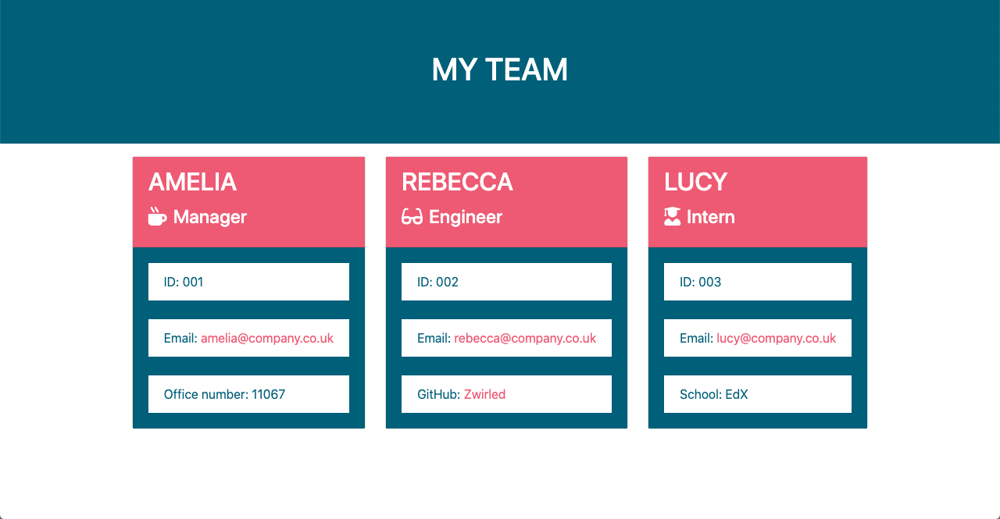

# Team Profile Generator

## Description

Week 12: Challenge 11 – Team Profile Generator

This is a command line application that prompts the user to input information about members of a development team. This includes managers, engineers and interns. The user is prompted from various information such as name, ID, email address and role-specific information. It generates a HTML file that displays all of the inputted information.

It uses the Inquirer packag to prompt the user for the team information, as well as Jest testing framework to ensure the application behaves as expected.

## Table of Contents

- [Installation](#installation)
- [Usage](#usage)
- [Contributing](#contributing)
- [Tests](#tests)
- [License](#license)

## Installation

View the repository on GitHub at https://github.com/Zwirled/team-profile-generator/
And the generated team.html file on GitHub pages at https://zwirled.github.io/team-profile-generator/assets/output/team.html

## Usage

To use the application, please type ‘node index.js’ into the command-line and answer the question prompts. The generated team can then be viewed in the browser by opening the team.html file.

## License

This project is licensed under the MIT license.

## Contributing

To contribute to this project, please either clone the GitHub repository, or get in touch.

## Tests

N/A

## Questions

To visit my GitHub profile, please click here: https://github.com/Zwirled.

If you have any questions, please send them to bramwellamelia@gmail.com and I will get back to you as soon as I can.
